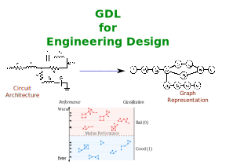

# Geometric Deep Learning for Engineering Design

Geometric Deep Learning (GDL) is a project that utilizes [PyG](https://github.com/pyg-team/pytorch_geometric) towards graph-based engineering designs.



Please cite our [conference paper](https://arxiv.org/abs/2303.09770) (and the respective papers of the methods used) if you use this code in your own work:


```
@Inproceedings{SiricoX1,
  title                    = {On the use of geometric deep learning towards the evaluation of graph-centric engineering systems},
  Author                   = {Sirico Jr., Anthony and Herber, Daniel R},
  Booktitle                = {(to appear) ASME 2023 International Design Engineering Technical Conferences},
  Month                    = aug,
  Year                     = {2023},
  Address                  = {Boston, MA, USA},
}
```

If you notice anything unexpected, please open an [issue](https://github.com/anthonysirico/GDL-for-Engineering-Design/issues) and let us know.
If you have any questions, feel free [to discuss them with us](https://github.com/anthonysirico/GDL-for-Engineering-Design/discussions).
