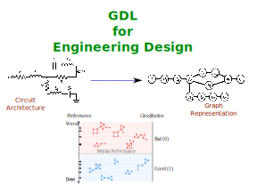

# Geometric Deep Learning for Engineering Design

Geometric Deep Learning (GDL) is a project that utilizes [PyG](https://github.com/pyg-team/pytorch_geometric) towards graph-based engineering designs.



It consists of a method that is capable of taking graph-based architectures to include both node-level and graph-level features for the purposes of architecture down-selection through iterative classification.
The current state of this project and its use is for the purposes of [graph classification](https://paperswithcode.com/task/graph-classification).
The method used here was [binary classification](https://www.learndatasci.com/glossary/binary-classification/).

## Data
The current data consists of a MATLAB `.m`[^Fn1] file that contains over 43,000 graphs that represent Analog Electric Circuits. 
Each circuit contains an adjacency matrix, node labels representing the various components in each circuit, and a graph-level label representing the performance of the circuit.[^Fn2]

## Required Python Libraries
Most of the libraries used are pre-built into Python, but please ensure that you have the following:
- [SciPy](https://scipy.org/)
- [NumPy](https://numpy.org/)
- [Pandas](https://pandas.pydata.org/)
- [tqdm](https://github.com/tqdm/tqdm)

The primary machine learning tools required to be installed are:
- [PyTorch](https://pytorch.org/)
- [PyTorch Geometric](https://pytorch-geometric.readthedocs.io/en/latest/)
- [NetworkX](https://networkx.org/)

## Running the Script
Once the files are downloaded, the `run.py` file is the primary script where you can adjust particular variables such as save paths.

## Future Data
This project is still ongoing, and more engineering architecture data will become available in the near future.

## Cite
Please cite our [conference paper](https://arxiv.org/abs/2303.09770) (and the respective papers of the methods used) if you use this code in your own work:


```
@article{10.1115/1.4063659,
    author = {Sirico, Anthony, Jr. and Herber, Daniel R.},
    title = "{On the Use of Geometric Deep Learning for the Iterative Classification and Down-Selection of Analog Electric Circuits}",
    journal = {Journal of Mechanical Design},
    volume = {146},
    number = {5},
    pages = {051703},
    year = {2023},
    month = {11},
    issn = {1050-0472},
    doi = {10.1115/1.4063659},
    url = {https://doi.org/10.1115/1.4063659},
    eprint = {https://asmedigitalcollection.asme.org/mechanicaldesign/article-pdf/doi/10.1115/1.4063659/7060879/md\_146\_5\_051703.pdf},
}


```

If you notice anything unexpected, please open an [issue](https://github.com/anthonysirico/GDL-for-Engineering-Design/issues) and let us know.
If you have any questions, feel free [to discuss them with us](https://github.com/anthonysirico/GDL-for-Engineering-Design/discussions).

[^Fn1]: MATLAB is not required to run this script. But, if you wish to manipulate any of the raw data, MATLAB or Octave is required.
[^Fn2]: D. R. Herber, T. Guo, J. T. Allison. 'Enumeration of architectures with perfect matchings.' ASME Journal of Mechanical Design, 139(5), p. 051403, May 2017. doi: 10.1115/1.4036132
